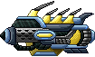

# GuardianShip v1.0
---
*В начале стояла задача повторить проект с данного [сайта](https://thecode.media/sozdayom-interfeys-igry-na-python-s-pomoschyu-pygame/).*

---
*В ходе переноса данного проекта появилась идея, воссоздать одну из старых игр, в которой нужно отстреливать корабли.*

---
**Мы начали обдумывать идеи и подбирали механики, которые будем реализовывать:**
- Добавление механики выстрела.
- Добавление механики здоровья.
- Изменение подсчёта очков.
- Доработка базовой механики.
- Добавление паузы.
- Добавление звуковых эффектов и музыки.

**Собрав все идеи мы начали подбирать спрайты для игры.**
*Игровая модель и пуля*

*Модели врагов*

*Спрайты здоровья*

*Фоны для игры*

*Также был добавлен шрифт Iceberg-Regular*

*Добавлены звуковые эффекты:*
- Взрыва.
- Выстрела.
- Смерти.
- Потери жизни.
- А также, фоновая музыка.

---
---

# GuardianShip v1.1
---

*Добавлена возможность игры вдвоем.*

---

**Изменены клавиши активации игры**
- Клавиша "1" - запускает одиночную игру.
- Клавиша "2" - запускает игру на двоих.

**А так же клавиши управления**
- "W", "S" - перемещение игрока 1, "D" - выстрел игрока 1.
- Для игрока 2, управление как в обычной игре, но выстрел на левую стрелку.
---

*Добавлены дополнительные звуковые эффекты*
- Звук выстрела для игрока 2.
- Звук победы в игре на двоих.
---